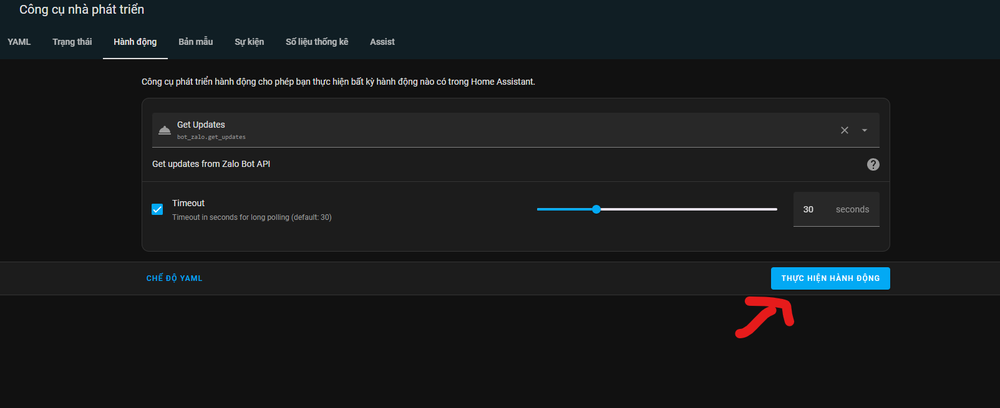
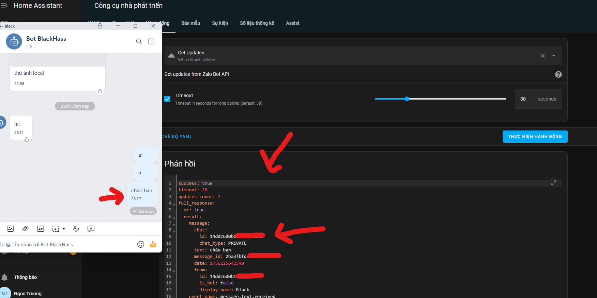

## ❓ Nhóm Support:
- Zalo: https://zalo.me/g/alvkgn274
- Telegram: https://t.me/smarthomeblack

# Bot Zalo

Component tích hợp Bot Zalo chính thức cho Home Assistant

## Tính năng

- Gửi tin nhắn
- Gửi ảnh
- Gửi Sticker
- Update webhook
- Get webhook info
- Get thông tin Bot

## Cài đặt
### Lấy token bot zalo

- Đọc kỹ hướng dẫn chính thức của Zalo: https://bot.zapps.me/docs/create-bot/
### Cài đặt qua HACS (khuyến nghị)

#### Phương pháp 1: Nút "Thêm vào HACS" (đơn giản nhất)

[](https://my.home-assistant.io/redirect/hacs_repository/?owner=smarthomeblack&repository=bot_zalo&category=integration)

1. Nhấp vào nút "Thêm vào HACS" ở trên (hoạt động khi bạn đã đăng nhập vào Home Assistant).
2. Xác nhận thêm kho lưu trữ vào HACS.
3. Tìm và cài đặt "Bot Zalo" từ menu HACS > Tích hợp.
4. Khởi động lại Home Assistant.
5. Thêm tích hợp: Cài đặt > Thiết bị & Dịch vụ > Thêm tích hợp > Bot Zalo.
6. Điền token


### Cài đặt thủ công

1. Tải xuống [bản phát hành mới nhất](https://github.com/smarthomeblack/bot_zalo/releases) hoặc sao chép nội dung repository.
2. Sao chép thư mục `custom_components/bot_zalo` vào thư mục `custom_components` trong cài đặt Home Assistant của bạn.
3. Khởi động lại Home Assistant.
4. Thêm tích hợp: Cài đặt > Thiết bị & Dịch vụ > Thêm tích hợp > Bot Zalo.
5. Chọn tỉnh/thành phố và quận/huyện mà bạn muốn hiển thị thông tin thời tiết.
6. Điền token

## Sử dụng

Sau khi cài đặt, sẽ có các Services để bạn có thể sử dụng

## Cách lấy Chat ID

### Bước 1: Sử dụng Service get_updates để lấy danh sách tin nhắn



1. Vào **Developer Tools** → **Services**
2. Chọn service `bot_zalo.get_updates`
3. Nhấn **Call Service**
4. Gửi tin nhắn bất kỳ tới bot zalo(chú ý thời gian chờ mặc định là 30s)

### Bước 2: Tìm Chat ID trong response



Trong phần `full_response` → `result`, bạn sẽ thấy:
```json
{
  "result": [
    {
      "message": {
        "chat": {
          "id": "1234567890",  // ← Đây là chat_id bạn cần
          "type": "private"
        },
        "from": {
          "id": "user_id",
          "first_name": "Tên người dùng"
        },
        "text": "Hello Bot"
      }
    }
  ]
}
```

Copy `chat.id` này để sử dụng trong các service khác như `send_message`, `send_photo`, v.v.


## Phát triển trong tương lai

- Đang cập nhập

## Đóng góp

Mọi đóng góp đều được hoan nghênh. Vui lòng tạo issues hoặc pull requests trên [GitHub](https://github.com/smarthomeblack/bot_zalo).